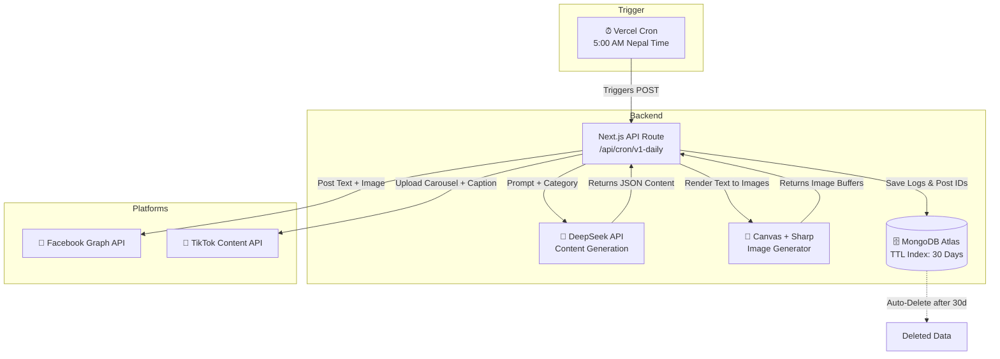
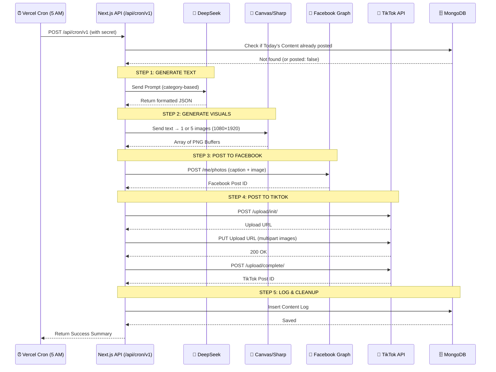

# AutoPost — Fully Automated Social Media Content System

An intelligent, fully automated content pipeline that generates, designs, and posts motivational, philosophical, and language-learning content to **Facebook** and **TikTok** daily at **5:00 AM Nepal Time** — with zero human intervention.

---

## System Architecture





---

## Content Categories & Generation Prompts

### Category: `motivation`

**Sub-types:** `book_quote`, `economic_mindset`, `rich_mindset`, `business_speech`

**Prompt:**
```
You are an expert social media content creator and polyglot educator.
Your task is to generate daily content for a fully automated posting system.
You must ALWAYS respond with a valid JSON object. Do not add markdown formatting,
code blocks, or extra commentary—ONLY raw JSON.

Generate a powerful, short motivational speech or quote (2-4 sentences) taken from
a famous book, economic principle, or business leader.
Make it actionable and inspiring for entrepreneurs.
Include the author's name and the book's name if applicable.
```

**Output JSON structure:**
```json
{
  "category": "motivation",
  "sub_type": "book_quote",
  "title": "The Obstacle Is the Way",
  "content_body": "What stands in the way becomes the way. — Marcus Aurelius, Meditations",
  "hashtags": ["#Nepali", "#Motivation", "#BookQuote", "#Entrepreneur", "#Mindset"],
  "image_prompt": "Dark background with golden text, an open ancient book on a wooden table"
}
```

---

### Category: `enlightenment`

**Sub-types:** `philosophical_thought`

**Prompt:**
```
Generate a deep, philosophical thought about mindfulness, inner peace, or self-awareness.
Keep it concise (2-3 sentences) but profound.
Make it relatable to modern daily life.
Output JSON.
```

**Output JSON structure:**
```json
{
  "category": "enlightenment",
  "sub_type": "philosophical_thought",
  "title": "The Noise Within",
  "content_body": "Peace is not the absence of chaos, but the ability to find stillness within it. In a world that never stops screaming, silence becomes the bravest rebellion.",
  "hashtags": ["#Nepali", "#Enlightenment", "#Mindfulness", "#InnerPeace", "#Philosophy"],
  "image_prompt": "Minimalist zen background, person meditating on a mountain at sunrise"
}
```

---

### Category: `language`

**Target languages:** `english`, `japanese`, `korean`  
**Level:** `basic_to_advanced`

**Prompt:**
```
Generate exactly 10 Nepali words/phrases with their translations and example sentences.
The list must progress from Basic (words 1-3) to Intermediate (4-7) to Advanced (8-10).
For each word, provide:
- The Nepali word.
- The translation in the target language.
- A simple example sentence in the target language.
Return the result strictly inside the "word_list" array in the JSON.
```

**Output JSON structure:**
```json
{
  "category": "language",
  "sub_type": "nepali_to_english",
  "title": "10 Nepali Words You Must Know",
  "content_body": "Learn Nepali from basic to advanced — one word at a time.",
  "hashtags": ["#Nepali", "#LearnNepali", "#Language", "#Education", "#Nepal"],
  "word_list": [
    { "nepali": "नमस्ते", "target": "Hello", "example": "Namaste, how are you?" },
    { "nepali": "धन्यवाद", "target": "Thank you", "example": "Dhanyabad for your help." }
  ],
  "image_prompt": "Colorful educational background, Nepali script and English translations side by side"
}
```

---

## Scheduling Logic

The system cycles through content categories each day to ensure variety:

| Day | Category | Sub-type Variety |
|-----|----------|------------------|
| Day 1 | `motivation` | Random: book_quote / business_speech |
| Day 2 | `enlightenment` | philosophical_thought |
| Day 3 | `language` | Random target language + level |
| Day 4 | `motivation` | Random: economic_mindset / rich_mindset |
| Day 5 | `enlightenment` | philosophical_thought |
| Day 6 | `language` | Different target language |
| Day 7 | `motivation` | Random pick from all sub-types |

Cycle repeats weekly. Detection is based on Nepal Time (UTC+5:45) day-of-week offset.

---

## Data Flow

| Step | Component | Action | Details |
|------|-----------|--------|---------|
| 1 | **Vercel Cron** | Triggers | Sends POST to `/api/cron/v1-daily` at 5:00 AM NPT |
| 2 | **Next.js API** | Checks DB | Verifies content hasn't been posted today |
| 3 | **DeepSeek API** | Generates | Returns JSON based on category prompt |
| 4 | **Canvas/Sharp** | Renders | Creates 1–5 images at 1080×1920px |
| 5 | **Facebook Graph** | Posts | Uploads image + caption via `/me/photos` |
| 6 | **TikTok API** | Uploads | Initiates → Uploads carousel → Publishes |
| 7 | **MongoDB** | Logs | Stores post IDs, content, and timestamp (TTL: 30 days) |

---

## MongoDB Schema

```
content_logs {
  _id: ObjectId
  date: String        // "2026-07-03"
  category: String    // "motivation" | "enlightenment" | "language"
  sub_type: String
  title: String
  content_body: String
  word_list: Array    // only for language category
  hashtags: Array
  facebook_post_id: String | null
  tiktok_post_id: String | null
  posted: Boolean
  created_at: Date    // TTL index — auto-deletes after 30 days
}
```

---

## Environment Variables

| Variable | Description |
|----------|-------------|
| `MONGODB_URI` | MongoDB connection string (default: `mongodb://localhost:27017/auto_post`) |
| `DEEPSEEK_API_KEY` | DeepSeek API key for content generation |
| `FACEBOOK_PAGE_ACCESS_TOKEN` | Facebook Page access token (long-lived) |
| `FACEBOOK_PAGE_ID` | Your Facebook Page ID |
| `TIKTOK_ACCESS_TOKEN` | TikTok API access token |
| `CRON_SECRET` | Secret to validate cron requests |

---

## Local Development

```bash
# Install dependencies
npm install

# Start MongoDB (local)
mongod

# Run dev server
npm run dev

# Trigger the cron manually
curl -X POST http://localhost:3000/api/cron/v1-daily \
  -H "Authorization: Bearer your-cron-secret"
```

---

## Tech Stack

- **Runtime:** Next.js 16 (App Router, TypeScript)
- **AI Provider:** DeepSeek API
- **Image Generation:** Sharp (server-side)
- **Database:** MongoDB with Mongoose (TTL index)
- **Scheduling:** Vercel Cron Jobs
- **Platforms:** Facebook Graph API v21.0, TikTok Content API v2
